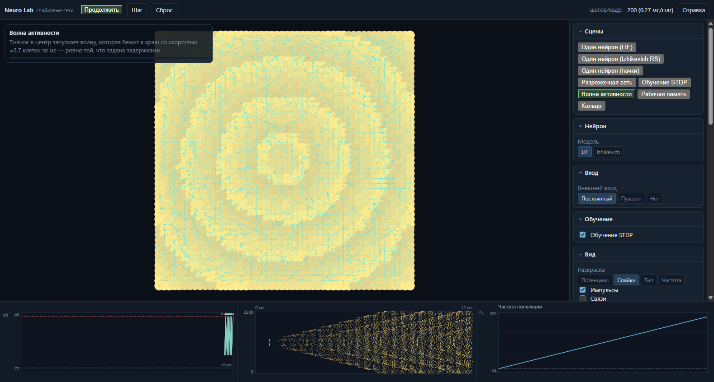
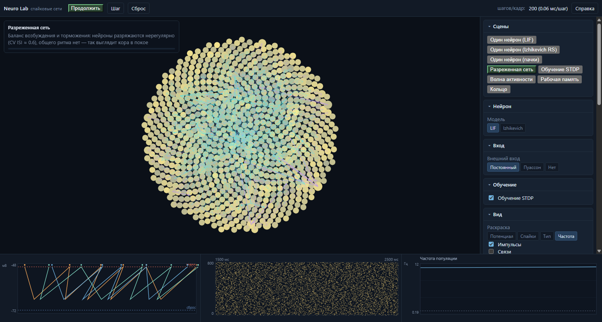
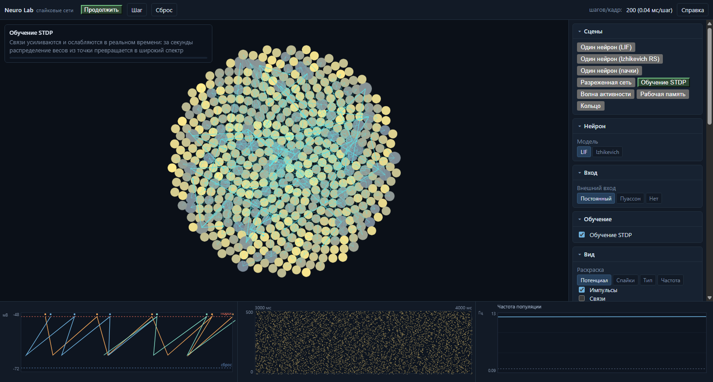
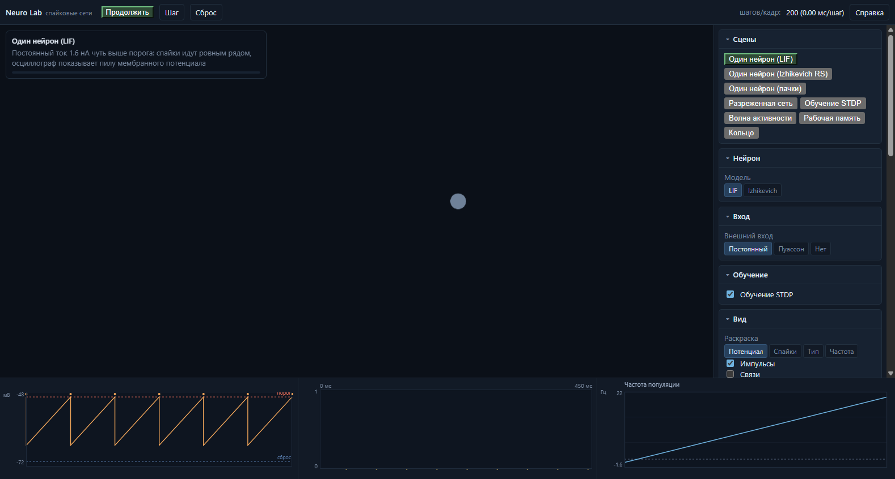
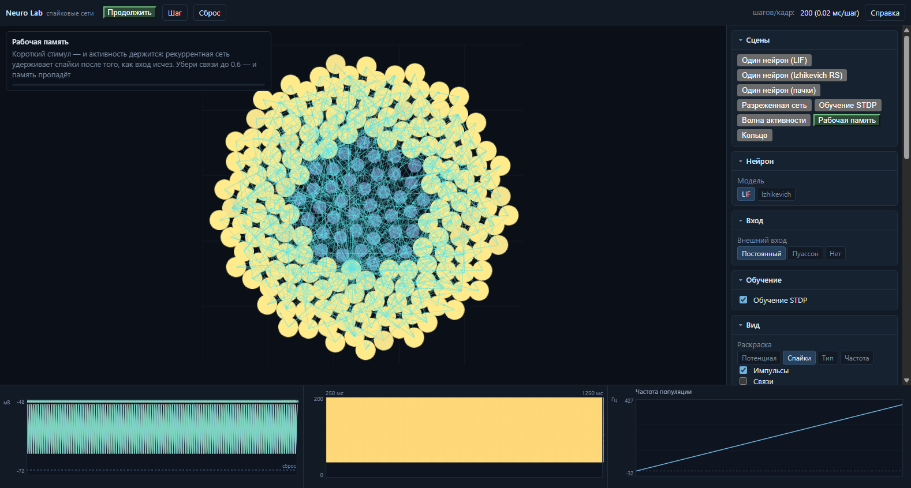
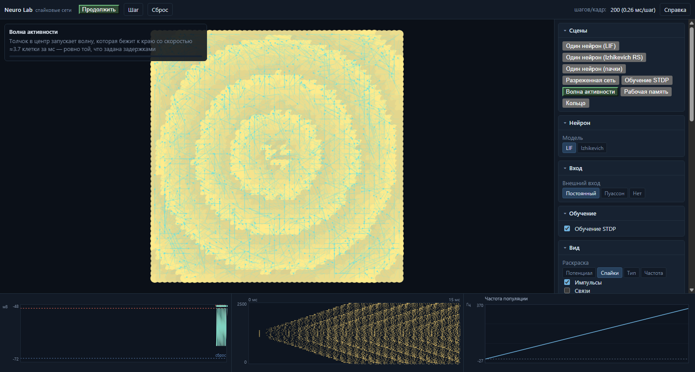
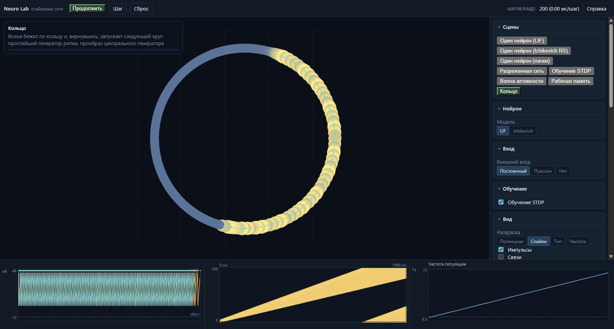

# Neuro Lab

[](LICENSE)

> ## ⚠️ Внимание: проект написан ИИ-агентом
>
> **Весь этот код, документация и тесты созданы и поддерживаются языковой моделью
> (ИИ-агентом), а не человеком-инженером.** Это не «альфа» и не «демо» — рабочий
> проект с зелёными тестами и проверками в настоящем браузере, но в нём **возможны
> ошибки, недоработки, локально странные решения и устаревшие комментарии**.
> Дефекты находим и устраняем по мере обнаружения (см. раздел «Найденные и
> исправленные дефекты»), но полностью гарантировать их отсутствие нельзя.
>
> **Практические следствия — читать до того, как что-то трогать:**
> 1. **Не доверяй коду вслепую.** Перед правкой сверяйся с `docs/NEXT-SESSION.md`
>    (контракты, инварианты, ловушки) и с тестами; ИИ-код часто выглядит
>    убедительнее, чем работает.
> 2. **Ничего не «чиним» молча.** Нашёл дефект — добавь регрессионный тест и отметь
>    его в README, а не правь «по ходу дела»: иначе следующая ИИ-сессия про него
>    не узнает.
> 3. **Ломать обратно легко.** ИИ-сессия, не прочитавшая `docs/NEXT-SESSION.md`,
>    с высокой вероятностью вернёт уже исправленный дефект.
> 4. **Юнит-тесты не видят браузер.** Пять дефектов из списка юнит-тесты не
>    поймали бы в принципе: неинициализированные нейроны, задержку в один лишний
>    шаг, невидимые частицы, нечитаемый текст интерфейса и пустые витринные кадры.
>    Меняешь рендер, вёрстку или запуск — прогоняй `npm.cmd run smoke` и
>    `npm.cmd run showcase`.
> 5. **Числа в README — измеренные.** Все пороги, веса и скорости получены
>    прогонами (замеры записаны в `docs/NEXT-SESSION.md`), а не назначены «на
>    глаз». Если правишь параметры — прогони сцену и сверься с текстом.
> 6. **Не закрывай браузер пользователя.** Проверки запускают СВОЙ headless-Chrome
>    с отдельным профилем и снимают только своё дерево процессов. Команды вида
>    «убить все chrome.exe» здесь запрещены — они уже один раз закрыли окна
>    человека за этой машиной.

Интерактивный симулятор спайковых нейронных сетей: нейроны с мембранным
потенциалом, порогом и рефрактерностью обмениваются спайками. Явления здесь
**не запрограммированы** — они **возникают** из простых правил: синхронизация,
волны активности, обучение связей, удержание активности после стимула.

Это та же методология, что в соседнем проекте phys_lab: простое правило →
численное интегрирование → эмерджентное поведение → количественная проверка.
Только вместо частиц — нейроны, а вместо сил — синапсы.



> **Что на кадре.** Решётка 50×50 (2500 нейронов), связанных по расстоянию, с
> задержкой, пропорциональной дистанции. Толчок в центр запускает волну: на
> сцене видно расходящееся кольцо возбуждённых нейронов, а справа внизу — ту же
> волну на **растровой диаграмме**: время слева направо, нейроны снизу вверх,
> точка = спайк. Наклонная полоса и есть фронт; её наклон — скорость волны.
> Слева внизу осциллограф: потенциал трёх самых активных нейронов с линиями
> порога и сброса.
>
> **Скорость измерена, а не заявлена.** Задержка связи задана как
> `расстояние / скорость проведения`, и измеренный наклон графика «расстояние от
> времени» совпадает с ней: **3.73 клетки/мс при заданных 4** (R² = 0.997).
> Это и есть доказательство, что волна порождена задержками, а не стимулом:
> при весе связи 20 тот же фронт идёт вдвое медленнее, а скорость проведения
> остаётся прежней.
>
> **Кадр воспроизводится командой** `npm.cmd run showcase` — она собирает все
> витринные кадры заново и падает с ненулевым кодом, если сцена оказалась почти
> пустой (проверяется доля светящихся пикселей на скриншоте, а не «нет ошибок в
> консоли»). Поэтому картинки в README не нужно обновлять вручную.

### Ещё шесть кадров из той же команды

| Разреженная сеть | Обучение STDP |
|---|---|
|  |  |

| Один нейрон (LIF) | Рабочая память |
|---|---|
|  |  |

**Проход импульсов по синапсам** — тот же кадр волны, но с включённой
визуализацией передач: бирюзовые отрезки — возбуждающие связи, сиреневые —
тормозные. Отрезок укорачивается по мере полёта импульса, а после прихода
остаётся затухающий след связи.



> **Что именно нарисовано.** Каждый отрезок — РЕАЛЬНАЯ передача: спайк вышел
> из одного нейрона и придёт в другой через задержку, заданную связью.
> Время прихода берётся из того же слота буфера задержек, что и сама
> доставка тока, поэтому картинка не может разойтись с моделью — это
> проверяется тестом («записанное время прихода совпадает с моментом
> прихода тока»).
>
> **Честное ограничение.** Импульс летит 0.5–2 мс, а кадр покрывает ≈20 мс
> модельного времени: на коротких связях он выходит и приходит внутри одного
> кадра. Поэтому видно не «мультик про полёт», а поток вдоль связей, и
> движение читается на длинных задержках. Ускорять анимацию «чтобы было
> видно» здесь не стали: тогда картинка перестала бы соответствовать сети.

**Кольцо — единственная сцена, работающая генератором.** Волна обегает круг
и, вернувшись, запускает следующий. Измерено: **24 000 спайков в секунду,
устойчиво** — счётчик не растёт и не падает на протяжении минут модельного
времени, все 200 нейронов разряжаются многократно.



> **Что было не так.** Подсказка обещала «генератор ритма», а пресет
> показывал **одноразовый толчок**: волна обегала кольцо ровно один раз и
> гасла навсегда. Измерено по окнам 50 мс — `28 11 11 11 12 11 … 11 4 0 0 0`.
> Причину нашли разложением, меняя параметры и стимул ПО ОТДЕЛЬНОСТИ:
> старые параметры + новый стимул дали прирост 888 (мертво), новые
> параметры + старый стимул — 178 013 (живо). Значит дело в параметрах, и
> главный из них — **торможение**: при доле тормозных 20 % вернувшаяся волна
> попадала в заторможенную область и обрывалась.

> **Разреженная сеть.** 800 нейронов, 20 % тормозных, разреженность 10 %.
> Каждый нейрон — точка: яркие вспыхнули только что, голубоватые тормозные.
> Осциллограф внизу показывает три самые активные клетки, растровая диаграмма —
> однородный «ковёр» без общего ритма: это и есть сбалансированный режим коры,
> где нейрон срабатывает от флуктуаций, а не от среднего входа. Измерено:
> **CV ISI ≈ 0.6** (у метронома было бы 0, у пуассоновского процесса 1).
>
> **Обучение STDP.** 500 нейронов, правило включено. За секунды распределение
> весов перестаёт быть точкой: **3.1 млн обновлений** связей, часть синапсов
> усиливается, часть «вымирает» до нуля. Режим раскраски — «Потенциал».
>
> **Один нейрон.** Постоянный ток чуть выше порога: мембранный потенциал пилой
> растёт до −50 мВ, сбрасывается на −70 мВ и снова растёт. Пунктирные линии —
> порог и сброс; точки над пиками — моменты спайков. Слева внизу виден ровный
> ряд «зубьев»: это и есть генератор спайков, из которого собирается всё
> остальное. Пресет `bursting` (режим пачек) в README не показан: он
> воспроизводится командой и лежит в `docs/images/bursting.png`.
>
> **Рабочая память.** Стимул подан коротким импульсом и уже снят, а активность
> не прекратилась: рекуррентные связи поддерживают её сами. У этого режима есть
> измеримый порог — при плотности связей 0.6 активность гаснет за 100 мс, при
> 0.7 держится неограниченно долго (счётчик стабилизируется ровно на 735
> спайках).

---

## Быстрый старт

Двойной щелчок по **`start.bat`** — он проверит Node.js, при необходимости поставит
зависимости, соберёт проект, поднимет локальный сервер и откроет браузер.
Переменные окружения: `PORT` (по умолчанию 4175), `NO_BROWSER=1` — не открывать
браузер, `ALWAYS_BUILD=1` — пересобрать даже при готовой папке `dist`.

Или вручную:

```bash
npm.cmd install      # в PowerShell: npm.ps1 может блокироваться политикой запуска
npm.cmd run dev      # откройте адрес, который выведет Vite
```

| Команда | Что делает |
|---|---|
| `npm.cmd run dev` | Запуск в режиме разработки с горячей перезагрузкой |
| `npm.cmd run build` | Проверка типов + сборка в `dist/` |
| `npm.cmd run preview` | Локальный просмотр собранной версии |
| `npm.cmd test` | Юнит-тесты ядра (224 теста, ~16 с) |
| `npm.cmd run bench` | Замеры производительности ядра (5 замеров) |
| `npm.cmd run smoke` | Сквозная проверка в настоящем Chrome (35 проверок, включая мышь) |
| `npm.cmd run showcase` | Пересобрать витринные кадры `docs/images/*.png` (7 кадров) |
| `npm.cmd run typecheck` | Только проверка типов |

Собранная версия работает и с `file://`: база сборки относительная.

---

## Что уже готово

### Ядро нейрона

* **Модель LIF** (leaky integrate-and-fire) — одна переменная, **точное решение**
  между спайками. Именно поэтому частота не зависит от шага интегрирования:
  измерено совпадение в пределах 1 % при `dt` от 1.0 до 0.1 мс.
* **Модель Izhikevich** — две переменные и четыре параметра, схема из статьи
  (полушаг по `V`, восстановление по новому `V`).
* **Каталог из 27 нейро-вычислительных режимов**: тоническое и фазическое
  спайкование, пачки, chattering, адаптация, классы возбудимости 1 и 2,
  задержка ответа, подпороговые колебания, резонатор, интегратор, спайк и пачка
  оттормаживания, вариабельность порога, деполяризующий след, типы нейронов коры
  (RS, IB, CH, FS, LTS, TC, RZ).
* **Интерполированное время спайка** — момент пересечения порога вычисляется
  внутри шага, а не привязывается к его границе. Без этого время спайка зависело
  бы от `dt`, а STDP обучался бы на артефакте дискретизации.
* **Рефрактерность с учётом остатка шага.** Измерено: без этой поправки
  предельная частота LIF давала 400 Гц вместо 498 и, хуже, зависела от `dt`.

### Сеть

* **Разреженная матрица связей в формате CSR** плюс обратный индекс (нужен STDP:
  потенциация ищет связи, ведущие К спайкнувшему нейрону). Плотной матрицы нет.
* **Задержки как свойство синапса** — кольцевой буфер слотов. Проверено
  измерением: спайк приходит ровно через заданное число шагов.
* **Затухающий синаптический ток** (экспоненциальный синапс, τ = 5 мс) с
  нормировкой на шаг: площадь ВПСТ равна весу независимо от `dt`.
* **Четыре топологии**: разреженная случайная, слоистая с рекуррентным скрытым
  слоем, пространственная решётка, кольцо.
* **Внешний вход**: постоянный ток, пуассоновский поток, отсутствие. Режим входа
  определяет всё: пуассоновский вход даёт нерегулярный разряд (CV ≈ 0.6),
  постоянный — регулярный (CV ≈ 0).
* **Баланс возбуждения и торможения**: доля тормозных нейронов и отношение
  весов задаются отдельно.

### Обучение и явления

* **STDP через следы** — онлайн-правило (потенциация при пре-до-пост, депрессия
  при пост-до-пре), с **жёсткими и мягкими границами** весов.
* **Устойчивость обучения**: интеграл окна обучения отрицателен (депрессия чуть
  сильнее), поэтому сеть не саморазогревается. Проверено прогоном в 10⁵
  обновлений.
* **Конкурентное прореживание**: при длительном обучении часть связей доходит до
  нуля — измерено 1975 из 3188. Это ожидаемое свойство аддитивного STDP, а не
  дефект, и тест проверяет, что эффект НАБЛЮДАЕТСЯ.
* **Волны активности** на пространственной решётке с измерением скорости фронта.
* **Рабочая память** с измеренным порогом по плотности рекуррентных связей.
* **Спектр популяционной активности** — с тестами крайних случаев.

### Интерфейс и приборы

* **Сцена (Pixi 8 / WebGL)**: нейроны точками, вспышки спайков, тормозные
  нейроны отличимы по цвету, четыре режима раскраски.
* **Взаимодействие со сценой**: «удар током» протяжкой мыши (с кольцом
  кисти), масштаб колесом, панорама Shift+протяжкой. До этого сцена была
  **пассивной картинкой** — при всех зелёных тестах (см. дефект 27).
* **Визуализация прохода импульсов**: спайк, бегущий по синапсу, рисуется
  отрезком, который укорачивается по мере полёта; после прихода остаётся
  затухающий след связи. Возбуждающие — бирюзовые, тормозные — сиреневые.
  Время прихода берётся из того же слота буфера задержек, что и доставка
  тока, поэтому картинка не может разойтись с моделью.
* **Осциллограф** (Canvas2D): потенциал трёх самых активных нейронов, линии
  порога и сброса, отметки моментов спайка.
* **Растровая диаграмма** (Canvas2D): главный научный вид — время слева направо,
  нейроны снизу вверх. На ней сразу видно синхронный разряд, волну и ритм.
* **График частоты популяции** (Canvas2D): третья панель приборов, отвечает на
  вопрос «что происходит со всей сетью» — при обучении частота падает, при
  разгоне растёт, у кольца выходит на постоянную. Пунктир — порог «сеть
  молчит» (1 Гц).
* **Раскладка нейронов** для не-пространственных сцен — спираль Ван дер Корпута:
  площадь заполняется равномерно, точки не сливаются.
* **Кампания из 8 уровней** с теорией, подсказками и автопроверкой: от «увидеть
  спайк» до «удержать активность после стимула».

---

## Архитектура

### Стек и почему именно он

| Решение | Обоснование |
|---|---|
| **TypeScript** (strict) | Состояние — плоские типизированные массивы (потенциалы, следы STDP, CSR-матрица). Типы ловят целый класс ошибок (индекс не той длины, перепутанный след) ещё до запуска. |
| **Vite** | Мгновенный старт, встроенный TS, быстрая сборка. |
| **PixiJS 8 (WebGL)** | Нейроны — `Particle` в одном `ParticleContainer`: тысячи точек рисуются одним батчем. Canvas2D столько не тянет. |
| **Canvas2D для приборов** | Осциллограф, растровая диаграмма и графики обновляются реже сцены; Canvas2D здесь проще и дешевле WebGL. |
| **Без React, DOM вручную** | Интерфейс — десяток панелей с редкими обновлениями, а весь горячий рендер в Pixi. Свой `h()` убрал согласование состояния между фреймворком и сценой. |
| **Vitest** | Ядро не знает про DOM, поэтому тесты идут в чистом Node за секунды. |

### Структура

```
src/
  core/        ЯДРО. Ничего не знает про DOM, Pixi и localStorage.
    types.ts          модель состояния (SoA), единицы измерения, параметры
    neuron.ts         LIF (точное решение) и Izhikevich (схема статьи)
    neuron-types.ts   каталог 27 режимов: данные + протоколы стимула
    synapses.ts       CSR-матрица связей, буфер задержек, топологии
    network.ts        сборка: шаг, вход, стимулы, метрики
    stdp.ts           следы, онлайн-обновление, жёсткие и мягкие границы
    measures.ts       частота, CV ISI, синхронность, спектр
    spike-analysis.ts группы спайков, ISI, тренд (сигнатуры режимов)
    single-run.ts     стенд одиночного нейрона (для каталога и тестов)
    spike-history.ts  кольцевой буфер истории спайков
    pulse-trace.ts    след передач: кто, кому, когда — для визуализации
    wave.ts           измерение волны: скорость фронта, профиль по кольцам
    memory.ts         удержание активности и поиск ритма
    presets.ts        восемь сцен как данные
    scene.ts          сборка сцены из пресета
  input/       Ввод.
    scene-input.ts    мышь: удар током, панорама, масштаб; горячие клавиши
  render/      PixiJS и Canvas2D.
    scene.ts          нейроны, связи, сетка, импульсы, кольцо кисти
    raster.ts         растровая диаграмма
    oscilloscope.ts   осциллограф потенциалов
    plots.ts          графики непрерывных величин
    palette.ts        цветовые шкалы (квантиль, а не максимум)
    camera.ts         мир ↔ экран
  levels/      Кампания: уровни как данные, вычисление условий, сессия.
    levels.ts         8 уровней: теория, подсказки, декларативные условия
    checks.ts         вычисление условий по измеренным величинам
    session.ts        наблюдение и проверка (окно наблюдения)
  ui/          DOM-панели, markdown, стили.
  app/         Склейка: состояние и цикл приложения.
  test/        Юнит-тесты ядра (14 файлов, 224 теста).
scripts/
  smoke.mjs        32 сквозные проверки в настоящем Chrome (6 — настоящей мышью)
  showcase.mjs     8 витринных кадров с проверкой «сцена не пуста»
  browser.mjs      запуск и остановка СВОЕГО браузера
  cdp.mjs          клиент протокола DevTools без зависимостей
  png.mjs          разбор PNG для измерения яркости кадра
  fix-encoding.mjs проверка и починка кодировки исходников
```

### Как устроен шаг сети

```
1. собрать входящий ток      пришедшее по связям + внешний вход + стимулы
1a. затухание проводимости   экспоненциальный синапс (τ = 5 мс)
2. продвинуть нейроны        LIF или Izhikevich, спайки пишутся в буфер
3. STDP                      затухание следов → депрессия → потенциация
4. разослать спайки          в слоты буфера задержек
5. метрики                   синхронность, история частоты, история спайков
```

Порядок не произволен: спайк, отправленный на шаге `t`, не влияет на нейроны
того же шага — иначе задержка в один шаг превратилась бы в ноль, и сеть потеряла
бы причинность. Внутри STDP порядок тоже фиксирован: сначала затухание следов,
затем депрессия по следам пост-спайков, затем потенциация по следам пре-спайков.

---

## Нейронаука: что именно считается

### Две модели нейрона

**LIF** — интегратор с утечкой. Между спайками уравнение решается точно:

```
τ dV/dt = −(V − V_rest) + R·I
V(t) = V_∞ + (V₀ − V_∞)·exp(−t/τ),   V_∞ = V_rest + R·I
```

Точное решение, а не явный Эйлер, выбрано осознанно: у Эйлера ошибка накапливается
систематически, и частота спайков начинает зависеть от шага.

**Izhikevich** — две переменные, четыре параметра:

```
dV/dt = 0.04·V² + 5·V + 140 − u + I
du/dt = a·(b·V − u)
если V ≥ 30 мВ:  V ← c,  u ← u + d
```

Схема из статьи: `u` считается по **новому** `V`, а `V` обновляется двумя
полушагами. Обычный Эйлер искажает форму спайка и воспроизводит режимы иначе.

**Точка покоя — решение, а не константа.** Начальное состояние находится из
системы `0.04·V² + (5 − b)·V + (140 + I) = 0`, `u = b·V` (берётся устойчивый
корень). Распространённое «`u = b·V₀`» верно только тогда, когда `V₀` уже
является точкой покоя; иначе нейрон стартует вне равновесия и выдаёт паразитный
спайк до включения стимула.

### Каталог режимов: 27 строк, каждая с проверкой

Режим — это **данные**: четыре параметра плюс форма тока. Но каталог был бы
бесполезен без проверки, поэтому у каждого режима есть **тест на сигнатуру** —
свойство его спайковой последовательности, которым режим и определён:

| Режим | Сигнатура (что проверяет тест) |
|---|---|
| Тоническое спайкование | > 8 спайков, хвост ряда выровнен (CV < 0.1) |
| Фазическое спайкование | ровно 1 спайк при продолжающемся токе |
| Тонические пачки | ≥ 2 группы с коротким внутригрупповым ISI |
| Фазические пачки | одна группа, дальше тишина |
| Смешанный режим | группа в начале, затем одиночные спайки |
| Адаптация частоты | ISI в хвосте в 1.5+ раза длиннее |
| Класс 1 | вблизи порога частота — единицы герц и растёт плавно |
| Класс 2 | первый интервал короткий: частота не нарастает от нуля |
| Спайк/пачка оттормаживания | тишина при тормозном токе, спайк(и) после снятия |
| Вариабельность порога | импульс 2 мс не спайкует, 3 мс — спайкует |
| FS против RS | FS чаще и почти не адаптируется |
| CH | внутрипачечный ISI < 10 мс, межпачечный > 20 мс |

**Честность каталога.** Три режима помечены `known-limitation` и **тест ожидает
провала** их сигнатуры: бистабильность (в двух переменных второго устойчивого
состояния не возникает) и аккомодация (пандус и ступенька дают одинаковый
частый разряд). Тест существует намеренно: если кто-то приведёт параметры в
порядок и режим заработает, тест упадёт и заставит обновить статус. Молчаливое
«мы это не проверяем» было бы хуже.

Параметры `(a, b, c, d)` взяты из `figure1.m` — программы, которой автор построил
Figure 1 работы 2004 года. Протоколы стимула подбирались **измерениями**; история
подбора и найденные при этом ошибки — в `docs/NEXT-SESSION.md`.

### Величины, которые различают режимы

Одного взгляда на сцену мало, чтобы понять, что происходит с сетью, поэтому
каждый режим описывается числом:

| | Регулярный разряд | Нерегулярный (кора) |
|---|---|---|
| **CV ISI** = σ(ISI)/mean(ISI) | ≈ 0 | ≈ 0.6…1 |
| **Источник режима** | постоянный ток | пуассоновский вход |
| **Что видно на диаграмме** | ровные горизонтальные штрихи | однородный «ковёр» |

Синхронность измеряется по бинам: доля спайков, попавших в одни моменты времени.
Крайние случаи проверены тестом: все спайки в одном бине → 1.0, равномерно по
бинам → 0.0, спайков нет → **NaN** (не ноль: «нет данных» и «ноль» — разные
состояния).

### Три явления, проверенные измерением

**Волна.** Задержка связи = `расстояние / скорость проведения`. Измерено:
наклон «расстояние от времени» равен 3.73 при заданных 4 и 7.39 при заданных 8
(R² = 0.99–1.00). Сила связи фронт не ускоряет: при весе 20 он идёт вдвое
медленнее, при 800 — почти так же быстро, как при 200. Порог распространения
есть: при весе ниже ≈ 50 волна затухает, не дойдя до края.

**Кольцо (генератор ритма).** Единственная сцена с самоподдержкой: волна
обегает круг и запускает следующий. Измерено — **24 000 спайков в секунду,
устойчиво** (счётчик не растёт и не падает на протяжении минут), все
200 нейронов разряжаются многократно. Пока пресет был настроен иначе
(торможение 20 %, вес 40), волна гасла после первого оборота — см. дефект 33.

**Рабочая память.** Сеть из входной и рекуррентной групп. Измерено:

| Плотность рекуррентных связей | Результат (вес 400) |
|---|---|
| 0.5 | 160 спайков и остановка — гаснет |
| 0.6 | 160 и остановка — гаснет |
| **0.7** | **735 и держится неограниченно** |
| 0.8 | 3850 и держится неограниченно |

Порог лежит между 0.6 и 0.7. При 0.7 счётчик стабилизируется ровно на 735
спайках и не меняется за 6 секунд наблюдения.

**STDP.** Измерено на 300 нейронах за 10 000 шагов: при выключенном правиле
0 обновлений и веса остаются ровно 0.1500; при включённом — **800 207
обновлений**, средний вес 0.1500 → 0.1280, разброс [0.0012, 0.2504].

### Ловушки, на которых проект уже спотыкался

**Синаптический ток одного шага.** Первая версия прибавляла вес спайка к току
ровно на один шаг. Это неверная биофизика (ВПСТ длится миллисекунды), и
рекуррентная сеть не могла поддержать активность **при любой силе связи**:
измерено, что при весах от 0.5 до 16 активность гасла за 100–300 мс. Лечится
затучающим синапсом; после исправления появился чёткий порог памяти.

**Задержка в один лишний шаг.** `endStep` сдвигал курсор, а `schedule` брал его
как базу слота: при вызове после `endStep` задержка 1 шаг становилась 2.
Опасность в том, что порядок вызовов в горячем цикле меняется при любой
перестановке строк.

**Точка покоя не по модели.** `initNeurons` ставил всем нейронам `izh.vRest`.
Это работало ровно до тех пор, пока `lif.vRest` и `izh.vRest` совпадали числом
(−65): совпадение констант маскировало ошибку. Как только точка покоя Izhikevich
была исправлена на истинную (−70), четыре теста сети разом упали. Мораль:
совпадение двух констант — не доказательство их равенства, поэтому тесты
пишутся на СВОЙСТВО («нейрон в покое не двигается»), а не на число.

**STDP читал не тот след.** Потенциация читала след пост-спайков самого нейрона
вместо следа пре-спайков источника. Правило переставало зависеть от времени и
превращалось в «усилить всё входящее при каждом спайке». Нашлось тестом «без
следа в паре вес не меняется»: вес рос там, где пары не было.

**Вспышка не успевала погаснуть.** Постоянная времени вспышки 25 мс при
межимпульсном интервале 20–40 мс: в живой сети светились 788 нейронов из 800,
и сцена была ровным жёлтым блином. 8 мс короче интервала, поэтому вспышка
читается как событие.

---

## Производительность

Замеры — на одном потоке Node, без отрисовки (`npm.cmd run bench`):

| Система | Связей | Шаг симуляции |
|---|---|---|
| 300 нейронов + STDP | 8 911 | 0.017 мс |
| 800 нейронов | 63 973 | 0.04 мс |
| 1600 нейронов | 255 726 | 0.087 мс |
| Решётка 50×50 (2500 нейронов) | 255 292 | 0.27 мс |

**Рост линеен по числу связей, а не квадратичен:** при увеличении их числа в
16.1 раза время шага выросло лишь в **4–5 раз** (кэш и постоянные накладные
расходы играют в пользу больших сетей). Квадратичный рост дал бы ×259.

Точное отношение здесь не приводится осознанно: при повторных прогонах оно
колеблется в пределах 4.3–5.5 (на 400 нейронах шаг то 0.016, то 0.021 мс —
разброс планировщика и кэша заметен на дешёвых замерах). Число с десятыми
долями выглядело бы измеренным точно, хотя на деле воспроизводится только
порядок. Пороги в самих тестах заданы с запасом (2–3 мс на шаг), поэтому
дрожание не делает прогон нестабильным.

Память не растёт со временем: за 20 000 шагов куча прибавляет около 5–6 МБ —
кольцевые буферы (история спайков, слоты задержек, следы STDP) не накапливают
данные.

Достижимый предел в браузере на одном потоке — примерно 20 000 нейронов при
разреженности 10 % и `dt = 0.5 мс`. Дальше нужен Web Worker или WebGPU (см.
`ROADMAP.md`).

---

## Найденные и исправленные дефекты

Все дефекты ниже реально случались в этом проекте. Раздел существует, чтобы
следующая сессия не «исправила» их обратно.

### Физика и численные методы

| № | Дефект | Как проявлялся | Чем ловится |
|---|---|---|---|
| 1 | **Рефрактерность теряла остаток шага** | Предельная частота LIF была 400 Гц вместо 498 и ЗАВИСЕЛА от `dt` | Тест «частота задана рефрактерностью и совпадает при разных dt» |
| 2 | **`u = b·V₀` вместо точки покоя** | Режимы оттормаживания давали спайк на 12-й мс при отрицательном токе — до включения стимула | Тест «спайк оттормаживания: ровно один, после снятия торможения» |
| 3 | **Режимам от торможения задан отрицательный ток** | Режимы не воспроизводились вовсе (0 спайков). В `figure1.m` им соответствует I = +80, а «торможение» задаётся знаком `b = −1` | Тесты про спайки и пачки от торможения |
| 4 | **Класс 1, класс 2, интегратор, аккомодация с неверными `(a, b)`** | Четыре режима не показывали характерного: класс 1 требует `b = −0.1`, класс 2 — `a = 0.2`, аккомодация — `b = 1` | Тесты сигнатур всех четырёх |
| 5 | **`twoPulses` включал ток с нуля** | Нейрон спайковал ДО «первого импульса», вариабельность порога измерить было нельзя | Тест «ток молчит до первого и между импульсами» |
| 6 | **Интегратор стартовал в равновесии для тока стимула** | Ровная линия `v₀ = vEnd = −71.754`: точка покоя считалась С учётом стимула, и нейрон никуда не двигался | Тест «заряжает мембрану без колебаний» |
| 7 | **`DEFAULT_IZH` задавал не точку покоя** | `dV/dt = −3 мВ/мс` в начальном состоянии: нейрон уезжал вниз с первого шага | Тест «точка покоя согласована с параметрами модели» |
| 8 | **Синаптический ток длился один шаг** | Рабочей памяти не возникало при ЛЮБОЙ силе связи (перебор 0.5…16 — одинаковое затухание) | Тест «порог по плотности рекуррентных связей» |

### Сеть и обучение

| № | Дефект | Как проявлялся | Чем ловится |
|---|---|---|---|
| 9 | **`Network` не инициализировал нейроны** | Нуль для LIF — это 0 мВ, ВЫШЕ порога: вся сеть выстреливала на первом такте | Тест «нейроны стартуют в покое и не спайкуют сами по себе» |
| 10 | **Задержка в 1 шаг превращалась в 2** | `schedule` после `endStep` попадал в следующий слот | Тест «спайк приходит ровно через задержку» (измеряет номера шагов) |
| 11 | **STDP читал след пост-спайков вместо пре-** | Правило переставало быть STDP: «усилить всё входящее при каждом спайке» | Тест «без следа в паре вес не меняется»; знак измеренного окна был неверным |
| 12 | **Амплитуда ВПСТ зависела от `dt`** | «Сила связи» перестала бы быть свойством связи | Нормировка площади ВПСТ на `dt/τ_syn` |
| 13 | **Прореживание весов до нуля принято за ошибку** | Тест требовал «вес > 0 у всех возбужающих» и падал на нулях. На деле это конкуренция — ожидаемое свойство | Тест «прореживание НАБЛЮДАЕТСЯ» (1975 из 3188) |

### Рендер и интерфейс

| № | Дефект | Как проявлялся | Чем ловится |
|---|---|---|---|
| 14 | **`ParticleContainer` не обновлялся** | Сеть из 800 нейронов рисовалась ОДНИМ кружком, хотя все частицы имели верные координаты и масштаб | `smoke`: «сцена не пуста» по скриншоту |
| 15 | **`boundsArea` не задан** | `extract.pixels` возвращал кадр 1×1 пиксель: проверка сообщала «0 %» на заполненной сцене | Измерение по скриншоту вместо API извлечения |
| 16 | **`extract.pixels` не видит частицы** | Число «светящихся» пикселей было ОДИНАКОВЫМ для 1 и 2500 нейронов | Разбор PNG в `scripts/png.mjs` |
| 17 | **Mojibake в исходниках** | Интерфейс показывал «РџСЂРѕРІРµСЂРєР°». Сборка проходила, тесты были зелёными | `smoke`: поиск русских подписей в тексте страницы; тест `encoding.test.ts`; `fix-encoding.mjs` |
| 18 | **Вспышка не успевала погаснуть** | Светились 788 нейронов из 800, сцена — ровный жёлтый блин | Витринный кадр + доля светящихся пикселей |
| 19 | **Нейроны сливались в блин** | Диаметр частицы вдвое превышал расстояние между соседями | Вывод размера из фактического экранного разброса |
| 20 | **Раскладка тремя кольцами** | При 800 нейронах вся сеть собиралась в узкое кольцо — «мишень» | Спираль Ван дер Корпута |
| 21 | **Камера подгонялась до `resize`** | Первый пресет открывался не в масштабе окна: подгонка считалась по исходным 800×600 | `resize` вызывает пересчёт камеры |
| 22 | **Пресет не выходил из кампании** | Сцена от пресета, а подсказки и проверки — от уровня | `smoke`: «применение пресета выходит из кампании» |
| 23 | **Справка накрывала сцену** | Витринные кадры получались с диалогом вместо сети | `smoke`: «справка закрывается»; витрина закрывает её перед съёмкой |
| 24 | **Сцена не реагировала на мышь** | Ни зума, ни панорамы, ни «тычка»: возможности были реализованы, но обработчики не подключены. **Все 26 проверок при этом были зелёными**, потому что `smoke` работал через API в обход DOM | `smoke`: 6 проверок НАСТОЯЩИМИ событиями указателя (`Input.dispatchMouseEvent`) |
| 25 | **Проверка «удар снимается» проверяла не то** | Мерила прирост спайков: на сцене с фоновым входом проходила бы даже без снятия стимула | Наблюдаемое `Network.spotActive` вместо косвенного следствия |
| 26 | **След импульсов сливался в полотно** | ~3300 отрезков при постоянной яркости давали ровную бирюзовую заливку | Яркость ∝ 1/√(число отрезков) |
| 27 | **Импульсы рисовались под нейронами** | В плотной решётке отрезок закрыт точками с обеих сторон: слой включён и невидим | Слой перенесён поверх нейронов |
| 28 | **Витрина снимала справку на чистом профиле** | Профиль сохранял флаг «справку видели», поэтому дефект не проявлялся. На чистом профиле все 7 кадров — с диалогом | Витрина ждёт 1200 мс до закрытия справки |
| 29 | **Радиус «удара током» означал разное в разных сценах** | Радиус был в мировых единицах, а масштаб мира у пресетов разный: измерено 16 нейронов в пятне на волне и 8 в разреженной сети. Удар по основным сетям был почти незаметен | Тест «один и тот же радиус накрывает одинаковое число нейронов при разном масштабе мира»; радиус задаётся в шагах между нейронами |
| 30 | **Проверка кодировки не видела новые файлы документации** | Список был задан явно, поэтому порча в любом новом `.md` в `docs/` проходила молча обеими проверками | Обе проверки обходят каталоги; тест «проверка покрывает ВСЕ файлы документации» |
| 31 | **Уровень «Рабочая память» нельзя было пройти** | Условие звало `measureMemory` с `maxMs: 0`: цикл не выполнялся ни разу, и «спайков после стимула» всегда было ровно 0 — при 200 активных нейронах | Тест «каждый уровень проходится» (`levels.test.ts`) для всех восьми уровней |
| 32 | **Уровень проходился в зависимости от времени наблюдения** | Мера адаптации падает со временем: 2.53 на 250 мс, 1.43 на 400 мс, **1.25 после 430** — ниже порога 1.4 навсегда. Кто смотрел дольше, тот пройти не мог | Тест «каждый уровень проходится и на 2×, и на 8× времени наблюдения»; окно измерения ограничено `observeMs` |
| 33 | **Пресет «Кольцо» не был генератором** | Подсказка обещала «генератор ритма», а волна обегала кольцо РОВНО ОДИН раз и гасла навсегда. Измерено по окнам 50 мс: `28 11 11 11 12 11 … 11 4 0 0 0` | Тест «волна бежит по кольцу И активность не прекращается» (проверяет и форму фронта, и удержание) |
| 34 | **«Кольцо» рисовалось диском, а не кругом** | Топология — цикл, а раскладка не-пространственных сцен — диск: дуга цикла рисовалась хордой через центр, и волна выглядела паутиной | Раскладка по окружности для `ring`; витринный кадр |
| 35 | **Уровень «Своя сеть» проходился сам собой** | Он требовал «поднять вес» и «добавить торможение» — но таких ползунков в интерфейсе не было, а условия выполнялись на нетронутом пресете (800 из 800 нейронов). Измерено: `passed = true` без действий | Раздел «Сеть» с ползунками веса, торможения и входа; условие `networkEdited` требует, чтобы сеть отличалась от пресета |
| 36 | **Ползунок торможения усиливал тормоз вчетверо** | Топология уже умножала тормозные веса на отношение (5), а правка умножила их ещё раз: измерено 5 → **20** после одного касания ползунка при неизменной доле тормозных нейронов | Тесты «правка доли торможения НЕ меняет соотношение весов» и «совместная правка веса и торможения сохраняет соотношение» |
| 37 | **Условие «удержание» росло вместе с временем наблюдения** | Измерено 578 мс на 600 мс наблюдения, 1180 на 1200, 2380 на 2400: условие «удержание ≥ 200 мс» выполнялось бы всегда, даже если активность погасла на 30-й мс | Скользящее окно шириной `observeMs`, прижатое к моменту проверки; тест «удержание НЕ растёт с временем наблюдения» |
| 38 | **Модуль графиков не использовался, а данные копились впустую** | `render/plots.ts` (225 строк) не импортировался ни одним файлом, а приложение КАЖДЫЙ КАДР собирало массив `trajectory` (600 точек «время — частота») и не читало его. README при этом обещал «графики непрерывных величин» | График частоты популяции подключён третьей панелью приборов; `smoke`: «график частоты популяции рисуется» |

### Дефекты окружения

| № | Дефект | Как проявлялся | Чем ловится |
|---|---|---|---|
| 34 | **`child.kill()` не убивал дерево процессов** | Накопилось 72 висящих процесса Chrome | `stopBrowser` через `taskkill /T` |
| 35 | **«Уборка всех chrome.exe» закрыла браузер человека** | Пользователь потерял открытые окна. **Категорически запрещено повторять** | Правило в `NEXT-SESSION.md`; проверка «нет живых `--headless` процессов после прогона» |
| 36 | **Chrome без `--no-sandbox` завершался с кодом 21** | Порт отладки не открывался, проверки не запускались | Флаги в `scripts/browser.mjs` |
| 37 | **PowerShell портит текст даже с `-Encoding UTF8`** | Правка счётчиков в README испортила весь файл: `Get-Content` без явной кодировки читает cp1251, и запись в UTF-8 лишь закрепляет порчу | Правки — инструментами файловой системы; после любой правки через PowerShell прогоняется `fix-encoding.mjs --check` |

---

## Кампания

Восемь уровней с теорией, подсказками и автопроверкой. Уровень — это данные
(`src/levels/levels.ts`), а условия проверки декларативны и вычисляются
отдельным модулем.

| № | Уровень | Что требуется |
|---|---|---|
| 1 | Спайк | Увидеть, как нейрон разряжается: ≥ 3 спайка |
| 2 | Адаптация | Убедиться, что интервалы к концу выросли (≥ 1.4×) |
| 3 | Пачки | Найти режим, где нейрон выдаёт группы спайков |
| 4 | Сеть в покое | ≥ 50 нейронов, CV ISI > 0.3 и **синхронность < 0.2** (нет общего ритма) |
| 5 | Обучение | Увидеть, как STDP расходится: > 1000 обновлений и разброс весов |
| 6 | Волна | Запустить волну: дошла > 10 клеток, фронт линеен (R² > 0.85) |
| 7 | Рабочая память | Удержать активность: рост спайков, охват и **удержание ≥ 200 мс** |
| 8 | Своя сеть | Изменить вес или торможение так, чтобы сеть осталась живой |

Проверки считаются по **окну наблюдения**, а не по одному кадру: мгновенная
синхронность и CV колеблются, и решение по одному замеру было бы случайным.
Перед началом измерения система проходит «выход на режим».

**Окно измерения ограничено `observeMs` уровня, и это не формальность.**
Пока проверки читали всю накопленную историю, вердикт зависел от того, как
долго игрок смотрел на сцену: измерено, что мера адаптации (уровень 2) равна
2.53 на 250 мс, 1.43 на 400 мс и **1.25 после 430 мс** — ниже порога 1.4
навсегда. Адаптация переходна по своей природе, поэтому «смотреть дольше»
означало «провалить уровень». Тест «каждый уровень проходится и на 2×, и на
8× времени наблюдения» следит, чтобы это не вернулось.

**Все восемь уровней проверяются автотестом** (`src/test/levels.test.ts`):
каждый проигрывается из своего пресета, и отдельно проверяется, что условия
НЕ проходят на молчащей сети. Это не перестраховка: уровень 7 был
непроходим из-за дефекта 31, и без такого теста его не видел никто.

---

## Управление

### Мышью

| Действие | Результат |
|---|---|
| **Протяжка по сцене** | **«Удар током»**: возбуждает нейроны в радиусе кисти, следуя за курсором |
| Колесо мыши | Масштаб с сохранением точки под курсором |
| Shift + протяжка, средняя кнопка | Сдвиг сцены (панорама) |

Кольцо кисти показывается **до** нажатия: видно, куда и какого радиуса будет
удар. Радиус и сила настраиваются в панели «Стимул». Удар действует, только
пока кнопка нажата, — отпустили, и стимул снят.

**Радиус задан в шагах между нейронами, а не в единицах мира.** Это не
придирка: масштаб мира у сцен разный (шаг 0.98 у волны против 1.78 у
разреженной сети), поэтому одинаковый радиус «в попугаях» давал бы разное
воздействие — измерено 16 нейронов в пятне в одной сцене и 8 в другой.
Теперь радиус 2.5 всюду означает «примерно 19 ближайших нейронов».

### Клавиатурой

| Клавиша | Результат |
|---|---|
| Пробел | Пауза / продолжить |
| `.` | Один шаг |
| `R` (или `К`) | Сброс сцены |
| `H` (или `Р`) | Справка |

### Панелью

| Действие | Результат |
|---|---|
| Пауза / Продолжить | Остановить и возобновить симуляцию |
| Шаг | Ровно один шаг интегрирования (с подсветкой кнопки) |
| Сброс | Вернуть сцену к прогретому старту пресета |
| Сцены | Переключение восьми сцен |
| Раскраска | Потенциал, спайки, тип нейрона, частота |
| Импульсы / Связи / Сетка | Показ слоёв (связи по умолчанию выключены: их перерисовка дороже симуляции) |
| Стимул | Сила и радиус «удара током» |
| **Сеть** | **Вес связей (множитель), торможение, амплитуда входа** |
| Обучение STDP | Включить и выключить правило |

Ползунки панели «Сеть» правят сцену **на живую**, не пересобирая её. Вес
задан множителем к исходному: базовые веса пресетов различаются на порядки
(200 у волны, 0.15 у разреженной сети), поэтому абсолютное число не подошло
бы никому. «Сброс» возвращает исходные значения пресета.

---

## Проверки

```bash
npm.cmd run typecheck     # типы
npm.cmd test              # 224 юнит-теста ядра, ~16 с
npm.cmd run build         # сборка
npm.cmd run preview       # в отдельном окне
npm.cmd run smoke         # 35 проверок в настоящем Chrome
npm.cmd run showcase      # 8 витринных кадров с проверкой «сцена не пуста»
```

**Что ловит `smoke`, чего не видят юнит-тесты:** канвас создан и имеет ненулевой
размер; интерфейс на русском и без mojibake; сцена не пуста (по скриншоту);
панели не перекрываются и скроллятся; метрики не `NaN`; «нет данных» показано
словами; все пресеты дают непустую сцену; волна доходит; память держится; STDP
обучает; **все восемь уровней кампании проходятся**; пауза останавливает
время; шаг делает ровно один шаг; сброс возвращает прогретый старт; узкое
окно не ломает вёрстку.

**Шесть проверок из них — НАСТОЯЩЕЙ мышью** (`Input.dispatchMouseEvent`):
протяжка по сцене запускает спайки, колесо меняет масштаб в обе стороны,
Shift+протяжка двигает камеру, кисть показывается при движении, удар
снимается при отпускании кнопки, импульсы рисуются и выключаются флажком.

Это принципиально, а не «ещё шесть проверок»: остальные управляют
приложением через `window.__neuroLab.actions.*`, то есть **в обход DOM**.
Такой проверке не видно, подключены ли обработчики событий вообще — именно
так сцена оставалась пассивной при 26 зелёных проверках (дефект 24).

**Важно:** `smoke` и `showcase` запускают СВОЙ headless-Chrome с отдельным
профилем (`--user-data-dir=.verify/...`) и отдельным портом отладки, а по
завершении снимают **только своё дерево процессов**. Окна пользователя они не
трогают — не «оптимизируй» это, убрав отдельный профиль.

---

## Что дальше

Уровень 1 доведён до состояния, когда физика нейрона верна, сеть работает,
обучение сходится, волны и память воспроизводимы, а результаты воспроизводимы
и измерены. В `ROADMAP.md` расписано, что дальше: модель Ходжкина-Хаксли,
кластеризация по STDP, ритмы через E/I-взаимодействие, Web Worker, WebGPU.

Ближайшие осмысленные шаги, по убыванию пользы:

1. **Web Worker для физики.** Ядро не знает про DOM — его можно вынести почти
   как есть. Критерий приёмки: тесты сети должны остаться зелёными.
2. **Гамма-ритм.** Сейчас спектр различает регулярный и нерегулярный вход, но
   устойчивого пика в 30–80 Гц получить не удалось. Нужен подбор τ торможения и
   задержек под PING-режим — и начинать надо с измерений.
3. **Кластеризация по STDP.** Правило уже работает; интересно посмотреть, как
   из случайной сети вырастают устойчивые группы.
4. **Сохранение сцены в JSON** вместе с состоянием RNG: сейчас
   воспроизводимость есть только внутри одного запуска.
5. **Модель Hodgkin-Huxley** как третий вариант нейрона.

Конкретные шаги и инварианты, которые нельзя нарушать, — в
[`docs/NEXT-SESSION.md`](docs/NEXT-SESSION.md).

---

## Лицензия

**MIT** — см. [`LICENSE`](LICENSE). Copyright (c) 2026 pL1uXa-AI.

Коротко: код можно свободно использовать, копировать, изменять, публиковать и
продавать; достаточно сохранить текст лицензии и указание авторства. Проект
поставляется «как есть», без гарантий.

Лицензия выбрана именно MIT по двум причинам: она максимально простая (одна
страница, без юридических конструкций) и не навязывает производным работам свою
лицензию — а для обучающего проекта это важно: код должен быть удобно
встраивать в уроки, курсы и чужие песочницы.
